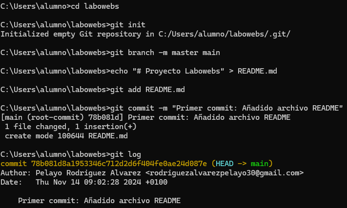
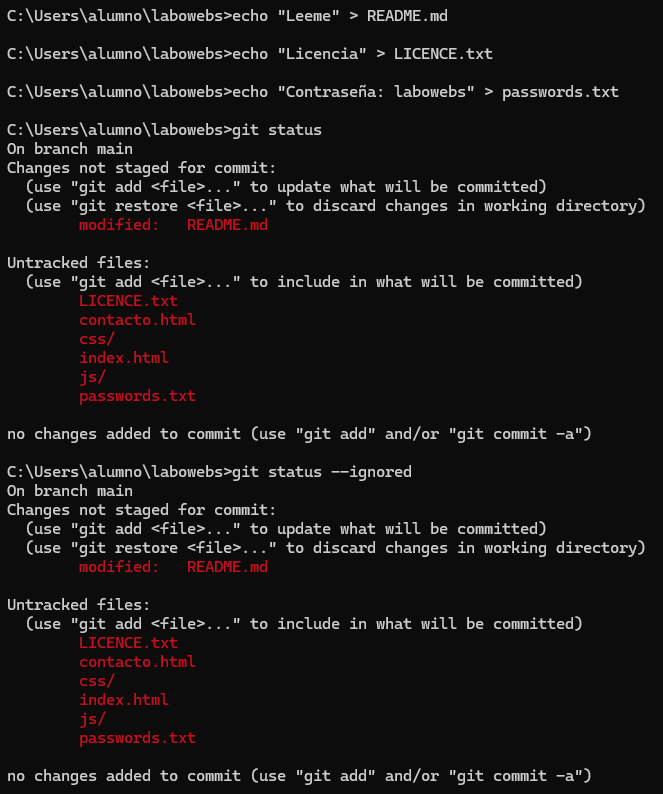
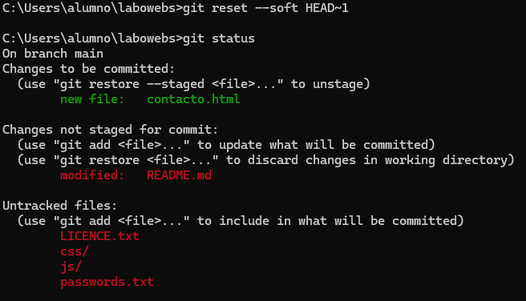

# Ejercicio de Git - proyecto labowebs

Pelayo Rodríguez Álvarez

[TOC]

## <u>Trabajo en local</u>

1. **Inicializa un nuevo repositorio Git en una carpeta llamada "labowebs" y agrega los archivos proporcionados en el aula virtual. Renombra la rama master a main , si es necesario. Realiza el primer commit. Muestra el log del repositorio.**

   ```bash
   $ git init
   $ git branch -m master main
   $ git commit -m "Primer commit o  commit inicial"
   $ git log
   ```

   

2. **Incluye un fichero .gitignore para que los ficheros README.md , LICENCE.txt y passwords.txt sean ignorados por el control de versiones. Realiza el commit y muestra los logs del repositorio en una línea.**

   ```bash
   $ echo "README.md" >> .gitignore
   $ echo "LICENSE.txt" >> .gitignore
   $ echo "passwords.txt" >> .gitignore
   $ git add .gitignore
   $ git commit -m "Añadido archivo .gitignore que ignora README.md, LICENSE.txt y passwords.txt"
   $ git log --oneline
   ```

   

3.  **En el repositorio, crea los archivos README.md , LICENCE.txt y passwords.txt con algún contenido. Muestra el estado del repositorio. Muestra el listado de archivos ignorados.**

   ```bash
   $ echo "Leeme" > README.md
   $ echo "Licencia" > LICENCE.txt
   $ echo "Contraseña: labowebs" > passwords.txt
   $ git status
   $ git status --ignored
   ```

   

4. **Crea una rama feature-estilos . Cámbiate a ella.** 

   **Modifica el archivo estilos.css :** 

   - **propiedad color del body y de h2 : #2a2a2a****

   - **propiedad background-color de header y footer: #2a75ff****

   - **Comprueba el estado del repositorio. Añade los cambios, realiza un commit con el mensaje "actualizados estilos a azules"**

   ```bash
   $ git checkout -b feature-estilos
   $ notepad estilos.css
   $ git status
   $ git add estilos.css
   $ git commit -m "actualizados estilos con nuevos colores"
   ```

   

5. **Vuelve a la rama main . En el archivo index.html añade un comentario donde se indique tu nombre como autor de la página. Comprueba el estado del repositorio. Añade los cambios, realiza un commit con el mensaje ' añadido autor en index'. Muestra los logs del repositorio en una línea, gráficamente y con 'decoración'**

   ```bash
   $ git checkout main
   $ notepad index.html
   $ git status
   $ git add index.html
   $ git commit -m "añadido autor en index"
   $ git log --oneline --graph --decorate
   ```

   

6. **Fusiona la rama feature-estilos en la rama main . Muestra los logs del repositorio en una línea, gráficamente y con 'decoración'**

   ```bash
   $ git checkout main
   $ git merge feature-estilos
   $ git log --oneline --graph --decorate
   ```

   

## <u>Trabajo en remoto</u>

1. **Continúa con el repositorio labowebs . Añade el repositorio a Sourcetree.**

   

2. **Crea un repositorio remoto y sube al remoto los ficheros de tu repositorio local. Debes subir todas las ramas.**

   ```bash
   $ git remote add origin https://github.com/Pelayo87/labowebs.git
   $ git push --all origin
   $ git push --tags
   ```

   

   

3. **Crea una rama feature-index . Añade el siguiente código dentro de la <section class = "about" . Añade los cambios y crea un commit. Sube los cambios al remoto.**

   ```bash
   $ git checkout -b feature-index
   $ code index.hmtl
   $ git add index.html
   $ git commit -m "Añadido contenido en section.about en index.html"
   $ git push origin feature-index
   ```

   

4.  **En el repositorio local, fusiona la rama feature-index en la rama main .**

   ```bash
   $ git checkout main
   $ git merge feature-index
   $ git status
   $ git push origin main
   ```

   

5. **Edita el fichero contacto.html . Borra unas líneas. Muestra los ficheros con cambios pendientes y las diferencias. Añade los cambios y haz un commit.**

   ```bash
   $ code contacto.html
   $ git status
   $ git diff contacto.html
   $ git add contacto.html
   $ git commit -m "Eliminadas líneas innecesarias de contacto.html"
   ```

   

6. **Te das cuenta del error. Deshaz el commit anterior. Captura el estado actual del repositorio.**

   ```bash
   $ git reset --hard HEAD~1
   $ git status
   ```

   

7. **Crea una rama feature-mapa . Incluye este código en el archivo contacto.html . Añade los cambios. Realiza un commit. Sube los cambios al remoto. Muestra en el remoto los cambios del archivo contacto.html en la rama feature-mapa .**

   ```bash
   $ git checkout -b feature-mapa
   $ code contacto.html
   $ git add contatco.html
   $ git commit -m "Añadido mapa de ubicación en contacto.html"
   $ git push origin feature-mapa
   ```

   

   

8. **En GitHub, en la rama main , fusiona la rama feature-mapa . Baja los cambios del remoto a local. Deja los dos repositorios sincronizados.**

   

   

## <u>Conflictos</u>

1. **Crea una rama hotfix-js . Cámbiate a ella. Añade este código en el fichero script.js . Confirma el cambio y haz un commit. (Fíjate en los números de línea...)**

   ```bash
   $ git checkout -b hotfix-js
   $ code script.js
   $ git add script.js
   $ git commit -m "Hotfix aplicado en script.js para corregir el error"
   $ git push origin hotfix-js
   $ git push origin hotfix-js
   ```

   

2.  **Vuelve a la rama main . En el fichero script.js en las mismas líneas que en la cuestión anterior, añade el código siguiente. Confirma el cambio y haz un commit.**

   
